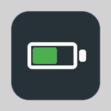
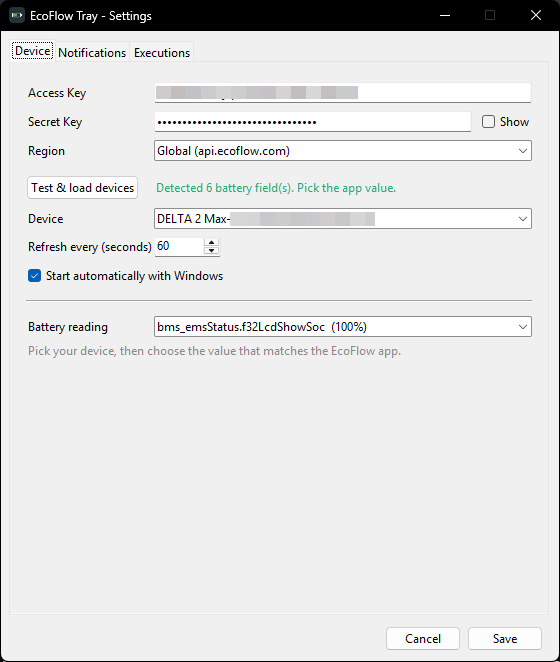

<h1 align="center">EcoFlow Tray</h1>

<p align="center">
  <br>
  <em>A tiny Windows system-tray battery monitor for EcoFlow power stations.</em>
</p>

Shows your EcoFlow battery percentage as a live tray icon, refreshed on an
interval you choose. Built for the **DELTA 2 Max** but works with any EcoFlow
device exposed through the official Developer API.

- 🟢 **Live tray icon** — color-coded: green (high), amber/orange (low), red (<15%), cyan (charging)
- ⚡ **Real-time updates over MQTT** — pushed live from EcoFlow's broker; the number keeps moving **without keeping the phone app open**
- 🖱️ **Right-click menu** — status, power in/out, time remaining, refresh, settings, quit
- ⚙️ **Settings UI** — enter your API keys, pick your device, set the polling interval; no file editing
- 🔋 **Smart battery-field detection** — reads your device's live data and lets you pick the value that matches the EcoFlow app (any model), with a custom option
- 🚀 **Start with Windows** — one checkbox
- 🔒 **Keys stay local** — stored per-user in `%APPDATA%`, secret encrypted with Windows DPAPI

<p align="center">
  
</p>

---

## Download

Grab the latest **`EcoFlowTray.exe`** from the [**Releases**](../../releases) page.
No install, no Python needed — it's a single self-contained executable.

> Windows SmartScreen may warn about an "unknown publisher" (the app is
> unsigned). Click **More info → Run anyway**.

## Setup

1. Create a free EcoFlow Developer account at <https://developer.ecoflow.com>.
   Once approved, generate an **AccessKey** + **SecretKey** under the Security /
   IoT section. Use the **same EcoFlow account your device is registered to** in
   the mobile app, or the keys won't see your device.
2. Run `EcoFlowTray.exe`. The Settings window opens on first run.
3. Enter your keys, choose your **Region** (Global or Europe), click
   **Test & load devices**, and pick your device.
4. Choose the battery reading that matches your app, set the refresh interval,
   and click **Save**.

## The "Battery reading" dropdown

EcoFlow devices expose several battery-percentage fields. There are two families:

| Family | What it is | Example (DELTA 2 Max) |
| --- | --- | --- |
| **App / LCD** | What the EcoFlow app and the unit's screen show | `bms_emsStatus.f32LcdShowSoc` = 54% |
| **Raw BMS pack** | The battery pack's own state of charge | `bms_bmsStatus.soc` = 83% |

They can differ, so the app doesn't guess blindly. After you pick your device,
Settings reads your device's **live** data and lists every battery field it
reports **with its current value** — just pick the number that matches your app.
`Custom field…` lets advanced users type an exact field name.

## How updates work

The EcoFlow HTTP endpoint (`quota/all`) returns a **cached snapshot** that only
refreshes while a session is active — which is why polling it alone leaves the
value frozen until you open the phone app. This app instead subscribes to
EcoFlow's **MQTT** stream (the same one the app uses), so the device pushes live
updates on its own. HTTP is used only for the initial reading and as a fallback
if MQTT goes quiet. The "Refresh every (seconds)" setting controls that fallback.

## Start with Windows

Tick **Start automatically with Windows** in Settings and Save. It adds a
per-user entry under `HKCU\…\CurrentVersion\Run` (no admin, no shortcut file).
Untick and Save to remove it.

## Where settings live

`%APPDATA%\EcoFlowTray\config.json` (one per Windows user). The secret key is
encrypted at rest with Windows DPAPI, tied to your user account. Nothing is
hard-coded — share the `.exe` freely; each person enters their own keys.

## Build from source

```bat
pip install -r requirements.txt pyinstaller
pyinstaller --onefile --noconsole --name EcoFlowTray ^
  --icon EcoFlowTray.ico --hidden-import pystray._win32 ^
  --exclude-module numpy ecoflow_tray.py
```

The executable lands in `dist\EcoFlowTray.exe`.

Dev helpers: `python ecoflow_tray.py --selftest` (imports/render check),
`python ecoflow_tray.py --make-icon EcoFlowTray.ico`.

## Credits

Battery-field mapping informed by the excellent
[tolwi/hassio-ecoflow-cloud](https://github.com/tolwi/hassio-ecoflow-cloud)
integration. Not affiliated with EcoFlow.

## License

[MIT](LICENSE)
