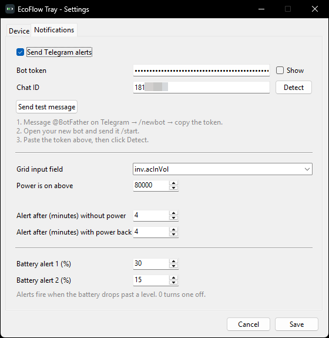

<h1 align="center">EcoFlow Tray</h1>

<p align="center">
  <br>
  <em>A tiny Windows system-tray battery monitor for EcoFlow power stations.</em>
</p>

Shows your EcoFlow battery percentage as a live tray icon, refreshed on an
interval you choose. Built for the **DELTA 2 Max** but works with any EcoFlow
device exposed through the official Developer API.

- 🟢 **Live tray icon** — color-coded: green (high), amber/orange (low), red (<15%), cyan (charging)
- ⚡ **Real-time updates over MQTT** — pushed live from EcoFlow's broker; the number keeps moving **without keeping the phone app open**
- 📲 **Telegram alerts** — get a message when the grid power drops and when it comes back, plus two battery-level warnings. You run your own bot; there's no server in the middle
- 🖱️ **Right-click menu** — status, power in/out, time remaining, refresh, settings, quit
- ⚙️ **Settings UI** — enter your API keys, pick your device, set the polling interval; no file editing
- 🔋 **Smart battery-field detection** — reads your device's live data and lets you pick the value that matches the EcoFlow app (any model), with a custom option
- 🚀 **Start with Windows** — one checkbox
- 🔒 **Keys stay local** — stored per-user in `%APPDATA%`, secret encrypted with Windows DPAPI

<p align="center">
  
  
</p>

---

## Download

Grab the latest **`EcoFlowTray.exe`** from the [**Releases**](../../releases) page.
No install, no Python needed — it's a single self-contained executable.

> Windows SmartScreen may warn about an "unknown publisher" (the app is
> unsigned). Click **More info → Run anyway**.

## Setup

1. Create a free EcoFlow Developer account at <https://developer.ecoflow.com>.
   Once approved, generate an **AccessKey** + **SecretKey** under the Security /
   IoT section. Use the **same EcoFlow account your device is registered to** in
   the mobile app, or the keys won't see your device.
2. Run `EcoFlowTray.exe`. The Settings window opens on first run.
3. Enter your keys, choose your **Region** (Global or Europe), click
   **Test & load devices**, and pick your device.
4. Choose the battery reading that matches your app, set the refresh interval,
   and click **Save**.

## The "Battery reading" dropdown

EcoFlow devices expose several battery-percentage fields. There are two families:

| Family | What it is | Example (DELTA 2 Max) |
| --- | --- | --- |
| **App / LCD** | What the EcoFlow app and the unit's screen show | `bms_emsStatus.f32LcdShowSoc` = 54% |
| **Raw BMS pack** | The battery pack's own state of charge | `bms_bmsStatus.soc` = 83% |

They can differ, so the app doesn't guess blindly. After you pick your device,
Settings reads your device's **live** data and lists every battery field it
reports **with its current value** — just pick the number that matches your app.
`Custom field…` lets advanced users type an exact field name.

## How updates work

The EcoFlow HTTP endpoint (`quota/all`) returns a **cached snapshot** that only
refreshes while a session is active — which is why polling it alone leaves the
value frozen until you open the phone app. This app instead subscribes to
EcoFlow's **MQTT** stream (the same one the app uses), so the device pushes live
updates on its own. HTTP is used only for the initial reading and as a fallback
if MQTT goes quiet. The "Refresh every (seconds)" setting controls that fallback.

## Telegram alerts

Tells you when the power goes out at home and when it comes back — plus a
warning when the battery gets low. Everything runs from your own machine: you
create your own bot, so there is no shared server and nobody else sees your data.

**Setup (about a minute)**

1. In Telegram, message [**@BotFather**](https://t.me/BotFather), send `/newbot`,
   pick a name, and copy the token it gives you.
2. Open your new bot's chat and send it `/start` — a bot cannot message you
   until you have talked to it first.
3. In **Settings → Notifications**, paste the token, click **Detect** to fill in
   your chat ID, then **Send test message** to confirm. Tick **Send Telegram
   alerts** and Save.

To send alerts to a group instead, add the bot to the group, post any message
there, then click Detect.

**What you get**

| Setting | What it does |
| --- | --- |
| **Grid input field** | The field watched to decide if grid power is present. Defaults to `inv.acInVol` (AC input voltage), auto-detected from your device with its live value shown below the box. If your device offers `bms_emsStatus.chgLinePlug` ("AC cable connected", zero vs non-zero), that is the most reliable choice of all. |
| **Power is on above** | Value above which the grid counts as present. The default is picked from the field and its live reading; the line underneath tells you whether the current value reads ON or OFF, so you can check it against reality. |
| **Alert after (minutes) without power** | The outage must last this long before you're told — a brief flicker stays quiet. |
| **Alert after (minutes) with power back** | Same idea for the recovery, so a power grid that stutters back on doesn't spam you. |
| **Battery alert 1 / 2 (%)** | Two levels (default 30% and 15%). Each fires once as the battery drops past it and re-arms after it recovers 5% above the level. `0` turns one off. |

Voltage is watched rather than watts on purpose: a full battery stops drawing
current, so input watts can fall to 0 while the grid is perfectly fine. Solar
input is deliberately excluded — panels are not "the lights are on".

Note that voltage does **not** drop to zero when the mains go: a DELTA 2 Max
idles at ~36 V / 41 Hz on a disconnected input, which is why the threshold sits
at 80 000 (mV) rather than just above zero. If your unit reports a different
idle value, the live reading under the field tells you where to put the bar.

**Other EcoFlow models.** Nothing is hard-coded to one device: the field list is
read from whatever your unit actually reports. Both naming generations are
recognised — `inv.acInVol` / `inv.inputWatts` / `pd.wattsInSum` on DELTA 2/Max,
DELTA Pro/Max/Mini and RIVER 2/Pro/Max, and `plug_in_info_ac_in_vol` /
`pow_get_ac_in` / `pow_in_sum_w` on DELTA 3, DELTA Pro 3 and RIVER 3 — including
the fact that the newer line reports volts where the older one reports
millivolts. Only the DELTA 2 Max has been verified against real hardware, so on
any other model check that the live reading flips between ON and OFF when you
unplug it, and adjust the threshold if it doesn't.

**Two things worth knowing**

- **Your router needs to survive the outage.** The alert travels over your
  internet connection, so if the modem dies with the grid, nothing can be sent.
  Put the router (and this PC) on the EcoFlow. If the connection drops anyway,
  alerts are queued and retried for up to 6 hours, and each message carries the
  time the event happened, not the time it was finally delivered.
- Alerts are driven by live readings, so if the app can't reach EcoFlow at all
  it has nothing to act on.

## Start with Windows

Tick **Start automatically with Windows** in Settings and Save. It adds a
per-user entry under `HKCU\…\CurrentVersion\Run` (no admin, no shortcut file).
Untick and Save to remove it.

## Where settings live

`%APPDATA%\EcoFlowTray\config.json` (one per Windows user). The EcoFlow secret
key and the Telegram bot token are encrypted at rest with Windows DPAPI, tied to
your user account. Nothing is hard-coded — share the `.exe` freely; each person
enters their own keys and their own bot.

## Build from source

```bat
pip install -r requirements.txt pyinstaller
pyinstaller --onefile --noconsole --name EcoFlowTray ^
  --icon EcoFlowTray.ico --hidden-import pystray._win32 ^
  --exclude-module numpy ecoflow_tray.py
```

The executable lands in `dist\EcoFlowTray.exe`.

Dev helpers: `python ecoflow_tray.py --selftest` (imports/render check),
`python ecoflow_tray.py --make-icon EcoFlowTray.ico`.

## Credits

Battery-field mapping informed by the excellent
[tolwi/hassio-ecoflow-cloud](https://github.com/tolwi/hassio-ecoflow-cloud)
integration. Not affiliated with EcoFlow.

## License

[MIT](LICENSE)
