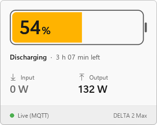
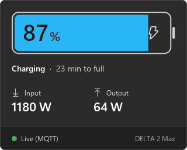
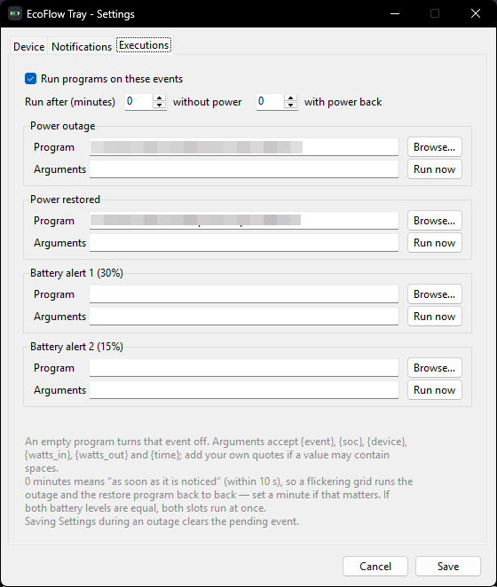

<p align="center">
  
</p>

<h1 align="center">EcoFlow Tray</h1>

<p align="center">A Windows system-tray battery monitor for EcoFlow power stations.</p>

<p align="center">
<a href="../../releases/latest"></a>
<a href="LICENSE"></a>
</p>

## About

EcoFlow Tray keeps your battery percentage in the notification area and refreshes it on its own, without the phone app open. It talks to your device through the official EcoFlow Developer API, so nothing is tied to a particular model, and it can tell you over Telegram when the mains go down or run a program of yours when they do.

It was written against a DELTA 2 Max and works with any device the Developer API exposes.

- A live tray icon, colored by charge: green at 60% and above, amber from 30, orange from 15, red below that, and cyan while charging.
- A flyout on left click with the charge, the power going in and out, the time left and the state of the live feed, in the taskbar's light or dark theme.
- Values pushed over MQTT, the same stream the mobile app listens to.
- Telegram alerts for grid outages and for two battery levels, sent through a bot you create yourself.
- Local programs launched on those same four events, each on its own delay.
- Battery-field detection, so you can pick the number that matches the app on any model.
- Start with Windows through a per-user registry entry. No administrator rights, no shortcut file.
- Credentials kept per user in `%APPDATA%`, with the secret key and bot token encrypted at rest through Windows DPAPI.

<p align="center">
  
</p>

## Download

The latest `EcoFlowTray.exe` is on the [releases page](../../releases). There is no installer and no Python to set up; the executable carries everything it needs.

> [!NOTE]
> The executable is unsigned, so SmartScreen may warn about an unknown publisher. Choose **More info**, then **Run anyway**.

## Setup

1. Create a free account at [developer.ecoflow.com](https://developer.ecoflow.com). Once it is approved, generate an **AccessKey** and a **SecretKey** under the Security / IoT section. Use the same EcoFlow account the device is registered to in the mobile app, or the keys will not see it.
2. Run `EcoFlowTray.exe`. Settings opens by itself the first time.
3. Enter both keys, choose your **Region** (Global or Europe), click **Test & load devices** and pick your device.
4. Choose the battery reading that matches your app, set the refresh interval, and save.

## The tray icon

The icon shows the charge as a number, in the colors listed above. Hover over it for a short summary, or left-click it for a larger panel: the charge, whether the unit is charging or discharging and how long it has left, the power going in and out, and whether the live feed is connected. The panel follows the taskbar's light or dark theme and closes when you click anywhere else or press Esc.

Right-click the icon for **Refresh now**, **Settings** and **Quit**.

<p align="center">
  
  
</p>

## The battery reading

EcoFlow devices expose several battery-percentage fields, in two families:

| Family | What it is | Example on a DELTA 2 Max |
| --- | --- | --- |
| App / LCD | What the EcoFlow app and the unit's own screen show | `bms_emsStatus.f32LcdShowSoc` = 54% |
| Raw BMS pack | The battery pack's own state of charge | `bms_bmsStatus.soc` = 83% |

The two can disagree by a wide margin, so the app does not guess. After you pick your device, Settings reads its live data and lists every battery field it reports with the value it currently holds, and you choose the one that matches your app. `Custom field…` takes an exact field name for anything the list misses.

## How updates work

The HTTP endpoint (`quota/all`) returns a cached snapshot that only refreshes while a session is active, which is why polling it alone leaves the number frozen until you open the phone app. EcoFlow Tray subscribes to the MQTT stream instead, the one the app itself uses, so the device pushes its own updates. HTTP is kept for the first reading and as a fallback when MQTT falls silent. **Refresh every (seconds)** governs that fallback, not the live feed.

## Telegram alerts

Alerts run entirely from your machine. You create your own bot, so there is no shared server and no third party in the path.

1. Message [@BotFather](https://t.me/BotFather), send `/newbot`, pick a name, and copy the token it hands you.
2. Open your new bot and send it `/start`. A bot cannot write to you until you have written to it first.
3. In **Settings → Notifications**, paste the token, click **Detect** to fill in the chat ID, then **Send test message**. Tick **Send Telegram alerts** and save.

To send to a group instead, add the bot to it, post any message there, and click Detect.

<p align="center">
  
</p>

| Setting | What it does |
| --- | --- |
| Grid input field | The field watched to decide whether grid power is present. Defaults to `inv.acInVol`, detected from your device, with its live value shown underneath. If your unit offers `bms_emsStatus.chgLinePlug` ("AC cable connected", zero against non-zero), that is the most reliable choice of all. |
| Power is on above | The value above which the grid counts as present. The default follows from the field and its live reading, and the line below tells you whether the current value reads ON or OFF so you can check it against reality. |
| Alert after (minutes) without power | How long the outage must last before you hear about it. A brief flicker stays quiet. |
| Alert after (minutes) with power back | The same for the recovery, so a grid that stutters back on does not spam you. |
| Battery alert 1 and 2 (%) | Two levels, 30% and 15% by default. Each fires once as the battery drops past it and re-arms once it has recovered 5% above the level. `0` turns one off. |

Voltage is watched rather than watts on purpose: a full battery stops drawing current, so input watts can fall to zero while the grid is perfectly fine. Solar input is excluded for a related reason. Panels charging the unit at noon say nothing about whether the mains are up.

Voltage does not fall to zero when the mains go, either. A DELTA 2 Max idles at roughly 36 V and 41 Hz on a disconnected input, which is why the default threshold sits at 80000 (mV) rather than just above zero. If your unit idles somewhere else, the live reading under the field tells you where to put the bar.

Both naming generations are recognised: `inv.acInVol`, `inv.inputWatts` and `pd.wattsInSum` on the DELTA 2/Max, DELTA Pro/Max/Mini and RIVER 2/Pro/Max, and `plug_in_info_ac_in_vol`, `pow_get_ac_in` and `pow_in_sum_w` on the DELTA 3, DELTA Pro 3 and RIVER 3, including the fact that the newer line reports volts where the older one reports millivolts. Only the DELTA 2 Max has been verified against real hardware, so on any other model unplug it once and check that the live reading flips between ON and OFF.

> [!IMPORTANT]
> The alert travels over your internet connection, so the router has to survive the outage too. Put it, and this PC, on the EcoFlow. If the connection drops anyway, alerts are queued and retried for up to six hours, and each message carries the time the event happened rather than the time it was finally delivered.

## Running programs on power events

The four events that send a Telegram message can also start something on this PC: a shortcut, an executable, a batch file or a script. Point the **Power outage** slot at the `.lnk` you already double-click and it will run the moment the mains go.

Open **Settings → Executions**, tick **Run programs on these events**, fill in the slots you care about, and save. An empty **Program** box means that event does nothing.

<p align="center">
  
</p>

| Setting | What it does |
| --- | --- |
| Run after (minutes) | The execution delays, separate from the Telegram ones. `0` runs the program as soon as the change is noticed, within ten seconds, so you can act at once and still get the message a minute later once the outage has proven real. |
| Program | What to launch. **Browse…** filters for `.lnk .exe .bat .cmd .vbs .ps1`, though any file with an association works. It is started the way a double click would start it, which is what makes Windows shortcuts and `.vbs` scripts work at all. |
| Arguments | Optional, and passed straight to the program rather than through a shell, so `&`, `\|` and `>` stay literal text. |
| Run now | Launches whatever is typed in the boxes without saving. The quickest way to try a path before relying on it. |

Arguments may contain `{event}` (`outage`, `restore`, `batt1` or `batt2`), `{soc}`, `{device}`, `{watts_in}`, `{watts_out}` and `{time}`. A name outside that list is left where it is, so a typo turns up in the command line instead of breaking the launch. Nothing is quoted for you: when a value can contain spaces, and `{device}` usually does, write the quotes yourself.

```
--name "{device}" --soc {soc} --at {time}
```

This has a few consequences:

- With a delay of `0`, a grid that flickers runs the outage program and then the restore program back to back. Set a minute if that would be a problem.
- If both battery levels are set to the same number, both slots run at once. You still get one Telegram message.
- Saving Settings during an outage discards whatever event was waiting out its delay.
- A program that fails to start appears as `Run: …` in the tray menu, and monitoring carries on regardless.

> [!WARNING]
> This runs programs of your choosing under your Windows account, without asking, from paths held in `%APPDATA%\EcoFlowTray\config.json`. It is the same trust the app already needs for the `HKCU\…\Run` entry it writes for Start with Windows, but anything able to edit that file decides what runs when the lights go out. Point these slots only at things you wrote or trust.

## Start with Windows

Tick **Start automatically with Windows** and save. It writes a per-user entry under `HKCU\Software\Microsoft\Windows\CurrentVersion\Run`, which needs no administrator rights and leaves no shortcut behind. Untick and save to remove it.

## Where settings live

In `%APPDATA%\EcoFlowTray\config.json`, one per Windows user. The EcoFlow secret key and the Telegram bot token are encrypted at rest with Windows DPAPI, tied to your account, so they cannot be read from another one. Nothing is baked into the executable, and you can pass it around freely; everyone enters their own keys and their own bot.

## Building from source

Requires Python 3.10 or newer on Windows.

```bat
pip install -r requirements.txt pyinstaller
pyinstaller --noconfirm EcoFlowTray.spec
```

The executable lands in `dist\EcoFlowTray.exe`.

Two helpers come with it:

```bat
python ecoflow_tray.py --selftest              :: imports and rendering, no network
python ecoflow_tray.py --make-icon EcoFlowTray.ico
```

The alerting logic has offline tests that stub out every Windows and GUI module, so they run anywhere:

```bash
python3 tools/test_alerts.py
```

They cover outage debouncing, battery thresholds, the Telegram retry queue, program execution, and AC-input field detection across both EcoFlow naming generations. `tools/test_api.py` is a separate script that checks API connectivity and dumps the fields a device reports, for when you need to see the raw data.

## Credits

The battery-field mapping was informed by the [tolwi/hassio-ecoflow-cloud](https://github.com/tolwi/hassio-ecoflow-cloud) integration. This project is not affiliated with EcoFlow.

## License

Released under the [MIT license](LICENSE).
